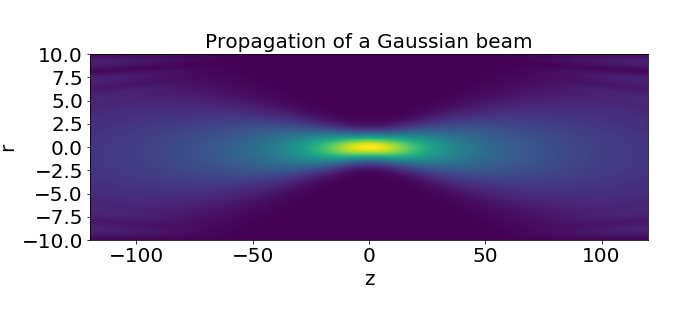
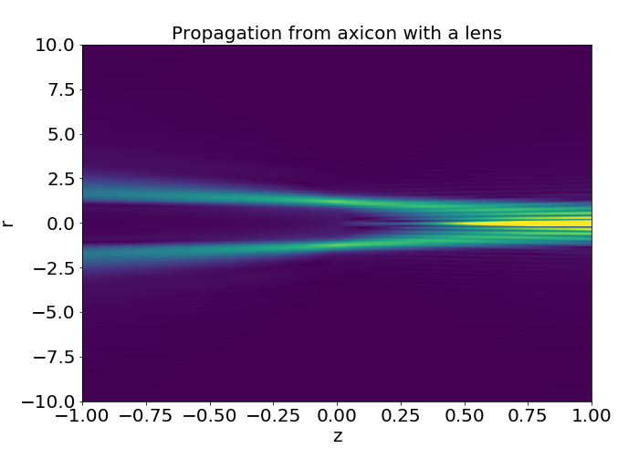

Helmholtz Propagator
============
Propagate a light field by solving the Helmholtz equation. 

## How does it work?
This is numerically achieved by applying the following transfer function:

%7D%5Cright))

in the Fourier domain, so that if the initial E-field is ) then

%20%3D%20%5Cmathfrak%7BF%7D%5E%7B-1%7D%5Cleft%5C%7BH_%7B12%7D%5Ccdot%20%5Cmathfrak%7BF%7D%5C%7BU_0%5C%7D%5Cright%5C%7D)

Run the jupyter notebook to see in action.

## Sample propagations

We can plot the propagation of something simple like a Gaussian beam:

or something more sophisticated like an axicon with a lens:

